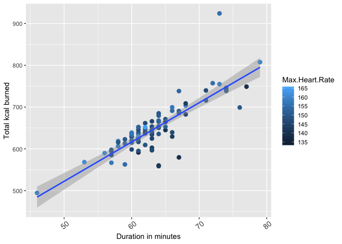
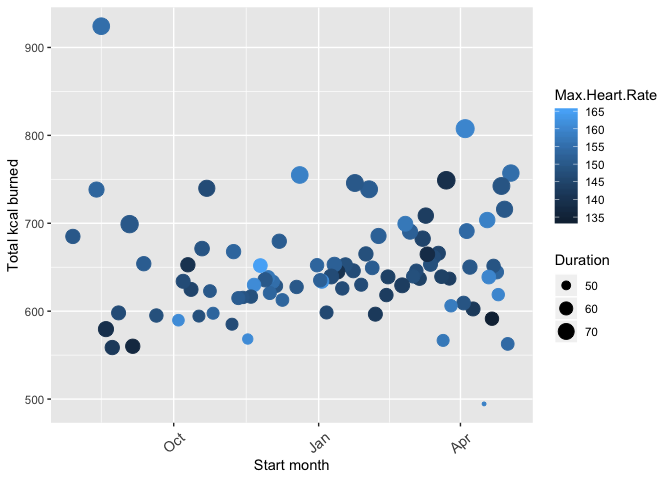

Hot Yoga Data Visualization from Apple Watch Data
================
Nick Orangio

``` r
#
#clean up the data set (remove non-yoga workouts, convert data to usable formats)
#

library("chron")

#import data
yoga_data = read.csv('/Users/nickorangio/Main Directory/Personal Projects/R Data Viz/allWorkouts04-May-2019.csv', header = TRUE, stringsAsFactors = FALSE)

yoga_data <- data.frame(yoga_data)

#subset for yoga data
yoga_subset <- subset(yoga_data, Type == "Yoga")

#remove unneeded columns
yoga_subset <- within(yoga_subset, rm(Distance, Average.Speed, Average.Pace))

#convert start and end to dates
yoga_subset$Start <- as.Date(yoga_subset$Start, format = "%Y-%m-%d")
yoga_subset$End <- as.Date(yoga_subset$End, format = "%Y-%m-%d")

#conert duration to minutes
yoga_subset$Duration <- as.character(yoga_subset$Duration)
yoga_subset$Duration <- times(yoga_subset$Duration)
yoga_subset$Duration <- minutes(yoga_subset$Duration) + 60*hours(yoga_subset$Duration)

#remove outlier (was not actually yoga)
yoga_subset <- yoga_subset[-2,]
```

``` r
library("ggplot2")

#kcal by duration
ggplot(yoga_subset, aes(x=Duration, y=Total.Energy.kcal)) + 
  geom_point(aes(colour=Max.Heart.Rate), size = 2.5) +
  theme(axis.text.x = element_text(size = 11, angle = 40, vjust = 0.7)) +
  ylab("Total kcal burned") + xlab("Duration in minutes") +
  geom_smooth(method = lm)
```



Exploratory analysis examining calories burned by duration shows a strong linear relationship, with calories burned increasing with longer durations.

``` r
#kcal by date
ggplot(yoga_subset, aes(x=Start, y=Total.Energy.kcal)) + 
  geom_point(aes(size=Duration, colour=Max.Heart.Rate)) +
  theme(axis.text.x = element_text(size = 11, angle = 40, vjust = 0.5)) +
  ylab("Total kcal burned") + xlab("Start month")
```



Calories burned over the last year are fairly consistent.

``` r
lm_model <- lm(Total.Energy.kcal ~ Average.Heart.Rate + Max.Heart.Rate + Duration
               , data = yoga_subset)

summary(lm_model)
```

    ## 
    ## Call:
    ## lm(formula = Total.Energy.kcal ~ Average.Heart.Rate + Max.Heart.Rate + 
    ##     Duration, data = yoga_subset)
    ## 
    ## Residuals:
    ##     Min      1Q  Median      3Q     Max 
    ## -69.909 -12.436   1.858  16.021 137.633 
    ## 
    ## Coefficients:
    ##                     Estimate Std. Error t value Pr(>|t|)    
    ## (Intercept)        -374.7580    82.2336  -4.557 1.74e-05 ***
    ## Average.Heart.Rate    4.9927     0.9206   5.423 5.52e-07 ***
    ## Max.Heart.Rate       -1.0585     0.7879  -1.343    0.183    
    ## Duration              9.5394     0.5525  17.267  < 2e-16 ***
    ## ---
    ## Signif. codes:  0 '***' 0.001 '**' 0.01 '*' 0.05 '.' 0.1 ' ' 1
    ## 
    ## Residual standard error: 26.77 on 84 degrees of freedom
    ## Multiple R-squared:  0.8081, Adjusted R-squared:  0.8012 
    ## F-statistic: 117.9 on 3 and 84 DF,  p-value: < 2.2e-16

``` r
nrow(yoga_subset)
```

    ## [1] 88
