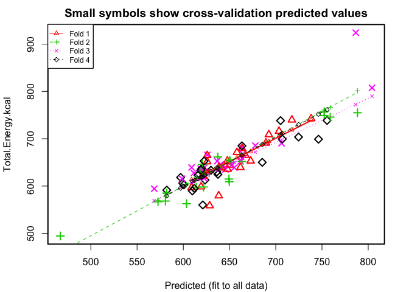

Hot Yoga Data Visualization from Apple Watch Data
================
Nick Orangio

``` r
#
#clean up the data set (remove non-yoga workouts, convert data to usable formats)
#

library("chron")

#import data
yoga_data = read.csv('/Users/nickorangio/Main Directory/Personal Projects/R Data Viz/allWorkouts04-May-2019.csv', header = TRUE, stringsAsFactors = FALSE)

yoga_data <- data.frame(yoga_data)

#subset for yoga data
yoga_subset <- subset(yoga_data, Type == "Yoga")

#remove unneeded columns
yoga_subset <- within(yoga_subset, rm(Distance, Average.Speed, Average.Pace))

#convert start and end to dates
yoga_subset$Start <- as.Date(yoga_subset$Start, format = "%Y-%m-%d")
yoga_subset$End <- as.Date(yoga_subset$End, format = "%Y-%m-%d")

#conert duration to minutes
yoga_subset$Duration <- as.character(yoga_subset$Duration)
yoga_subset$Duration <- times(yoga_subset$Duration)
yoga_subset$Duration <- minutes(yoga_subset$Duration) + 60*hours(yoga_subset$Duration)

#remove outlier (was not actually yoga)
yoga_subset <- yoga_subset[-2,]
```

``` r
library("ggplot2")

#kcal by duration
ggplot(yoga_subset, aes(x=Duration, y=Total.Energy.kcal)) + 
  geom_point(aes(colour=Max.Heart.Rate), size = 2.5) +
  theme(axis.text.x = element_text(size = 11, angle = 40, vjust = 0.7)) +
  ylab("Total kcal burned") + xlab("Duration in minutes") +
  geom_smooth(method = lm)
```


Exploratory analysis examining calories burned by duration shows a strong linear relationship, with calories burned increasing with longer durations.

``` r
#kcal by date
ggplot(yoga_subset, aes(x=Start, y=Total.Energy.kcal)) + 
  geom_point(aes(size=Duration, colour=Max.Heart.Rate)) +
  theme(axis.text.x = element_text(size = 11, angle = 40, vjust = 0.5)) +
  ylab("Total kcal burned") + xlab("Start month")
```


Calories burned over the last year are fairly consistent.

Next, a regression model will be fit to the data to develop a model that predicts total calories using average heart rate, max heart rate, and duration.

``` r
#fit full regression model
lm_model_full <- lm(Total.Energy.kcal ~ Average.Heart.Rate + Max.Heart.Rate + Duration
               , data = yoga_subset)

summary(lm_model_full)
```

    ## 
    ## Call:
    ## lm(formula = Total.Energy.kcal ~ Average.Heart.Rate + Max.Heart.Rate + 
    ##     Duration, data = yoga_subset)
    ## 
    ## Residuals:
    ##     Min      1Q  Median      3Q     Max 
    ## -69.909 -12.436   1.858  16.021 137.633 
    ## 
    ## Coefficients:
    ##                     Estimate Std. Error t value Pr(>|t|)    
    ## (Intercept)        -374.7580    82.2336  -4.557 1.74e-05 ***
    ## Average.Heart.Rate    4.9927     0.9206   5.423 5.52e-07 ***
    ## Max.Heart.Rate       -1.0585     0.7879  -1.343    0.183    
    ## Duration              9.5394     0.5525  17.267  < 2e-16 ***
    ## ---
    ## Signif. codes:  0 '***' 0.001 '**' 0.01 '*' 0.05 '.' 0.1 ' ' 1
    ## 
    ## Residual standard error: 26.77 on 84 degrees of freedom
    ## Multiple R-squared:  0.8081, Adjusted R-squared:  0.8012 
    ## F-statistic: 117.9 on 3 and 84 DF,  p-value: < 2.2e-16

``` r
mean(lm_model_full$residuals^2)
```

    ## [1] 684.2156

A simple linear regression model is a pretty good fit, with a high coefficient of determination (0.81) indicating the model explains much of the variability in total calories burned. The mean squared error on the training data is 684. The summary of the model indicates that average heart rate and duration are statistically significant (p &lt; 0.05) in the model.

``` r
library("DAAG")
```

    ## Loading required package: lattice

``` r
#run cross validation
yoga_total_cv <- cv.lm(yoga_subset, lm_model_full, m = 4)
```

    ## Analysis of Variance Table
    ## 
    ## Response: Total.Energy.kcal
    ##                    Df Sum Sq Mean Sq F value  Pr(>F)    
    ## Average.Heart.Rate  1  28886   28886    40.3 1.1e-08 ***
    ## Max.Heart.Rate      1  10954   10954    15.3 0.00019 ***
    ## Duration            1 213700  213700   298.1 < 2e-16 ***
    ## Residuals          84  60211     717                    
    ## ---
    ## Signif. codes:  0 '***' 0.001 '**' 0.01 '*' 0.05 '.' 0.1 ' ' 1



    ## 
    ## fold 1 
    ## Observations in test set: 22 
    ##                       6      7     10    11     26     39    40    41
    ## Predicted         703.5 738.32 650.06 625.9 689.39 647.70 625.9 692.5
    ## cvpred            705.6 739.83 649.87 627.3 688.77 648.87 631.1 694.1
    ## Total.Energy.kcal 715.9 742.41 644.46 651.5 691.13 653.29 664.7 708.7
    ## CV residual        10.3   2.57  -5.41  24.3   2.36   4.43  33.7  14.6
    ##                       46    61     64  71    72    73    87     90      91
    ## Predicted         641.78 608.9 667.15 673 661.8 619.2 663.5 621.99 639.000
    ## cvpred            642.05 613.6 667.49 673 664.0 620.8 663.9 622.63 637.920
    ## Total.Energy.kcal 639.59 596.6 665.11 653 639.4 598.5 679.6 620.65 638.714
    ## CV residual        -2.46 -17.1  -2.38 -20 -24.6 -22.2  15.7  -1.98   0.794
    ##                      92 106   107   124   125
    ## Predicted         647.8 717 658.0 628.5 638.3
    ## cvpred            649.5 719 659.6 632.5 643.8
    ## Total.Energy.kcal 635.7 740 671.2 558.6 579.6
    ## CV residual       -13.8  21  11.5 -73.8 -64.3
    ## 
    ## Sum of squares = 14502    Mean square = 659    n = 22 
    ## 
    ## fold 2 
    ## Observations in test set: 22 
    ##                        1     5    17    29     34     35    38    44
    ## Predicted         752.38 603.5 467.0 649.7 752.45 572.66 637.4 620.6
    ## cvpred            760.67 603.4 460.0 654.1 755.55 569.49 639.7 621.4
    ## Total.Energy.kcal 757.11 562.8 494.5 609.2 748.90 566.74 661.5 646.0
    ## CV residual        -3.56 -40.6  34.5 -44.8  -6.66  -2.75  21.7  24.6
    ##                       50     62    66  69     75    82     88    93    96
    ## Predicted         628.08 651.32 758.9 624 639.71 788.4 617.99 663.3 580.6
    ## cvpred            623.84 655.76 766.1 625 639.73 801.3 619.48 668.5 583.9
    ## Total.Energy.kcal 629.40 649.29 745.8 626 634.04 754.9 628.66 651.9 568.3
    ## CV residual         5.57  -6.47 -20.3   1  -5.68 -46.4   9.18 -16.6 -15.6
    ##                      98   100   104    118   122
    ## Predicted         649.3 582.1 614.0 650.31 621.9
    ## cvpred            656.1 581.6 618.5 651.88 620.3
    ## Total.Energy.kcal 614.9 585.2 597.6 654.00 598.0
    ## CV residual       -41.2   3.6 -20.8   2.12 -22.2
    ## 
    ## Sum of squares = 11911    Mean square = 541    n = 22 
    ## 
    ## fold 3 
    ## Observations in test set: 22 
    ##                        9    14    28    33    36    37    42     47    58
    ## Predicted         616.59 622.7 804.1 618.8 609.0 626.1 663.1 706.29 655.2
    ## cvpred            613.15 619.9 790.0 615.9 607.6 623.5 658.7 697.49 649.9
    ## Total.Energy.kcal 618.81 638.8 807.6 637.0 639.3 665.9 682.5 690.46 639.0
    ## CV residual         5.66  18.9  17.7  21.1  31.6  42.4  23.8  -7.03 -10.9
    ##                      60    65     67    68     70     76     77  83     95
    ## Predicted         677.9 622.0 640.39 636.6 652.65 645.56 662.10 611 622.45
    ## cvpred            671.7 618.9 636.46 633.0 648.28 640.48 655.49 610 619.53
    ## Total.Energy.kcal 685.5 630.1 645.93 652.8 644.95 635.17 652.26 628 616.58
    ## CV residual        13.8  11.2   9.47  19.7  -3.33  -5.31  -3.23  18  -2.95
    ##                      97     99   108 126
    ## Predicted         598.6 664.35 568.6 787
    ## cvpred            597.0 658.46 569.3 772
    ## Total.Energy.kcal 615.6 667.74 594.4 924
    ## CV residual        18.7   9.28  25.1 152
    ## 
    ## Sum of squares = 30017    Mean square = 1364    n = 22 
    ## 
    ## fold 4 
    ## Observations in test set: 22 
    ##                      12    16     24    25     32    43    49    59    63
    ## Predicted         582.1 724.7 600.56 685.4 599.40 619.9 707.1 597.1 755.5
    ## cvpred            579.1 729.9 599.50 687.7 599.79 619.4 711.3 595.7 761.3
    ## Total.Energy.kcal 591.4 703.7 602.53 650.1 606.11 637.1 699.4 618.3 738.7
    ## CV residual        12.3 -26.2   3.03 -37.6   6.31  17.7 -11.9  22.6 -22.7
    ##                      85     89     94    105 109 110   111   113   116
    ## Predicted         623.5 629.86 636.25 615.92 637 622 619.1 609.8 611.8
    ## cvpred            623.9 630.88 638.47 615.71 638 622 619.2 610.5 611.6
    ## Total.Energy.kcal 612.8 633.41 629.84 622.87 625 653 634.0 589.7 595.1
    ## CV residual       -11.2   2.53  -8.63   7.17 -13  31  14.7 -20.8 -16.5
    ##                     120 121   127   131
    ## Predicted         621.1 746 705.2 663.4
    ## cvpred            619.9 752 708.9 665.2
    ## Total.Energy.kcal 560.1 699 738.3 685.0
    ## CV residual       -59.8 -53  29.4  19.8
    ## 
    ## Sum of squares = 13735    Mean square = 624    n = 22 
    ## 
    ## Overall (Sum over all 22 folds) 
    ##  ms 
    ## 797

``` r
#manually calculate r squared (SSR/SST or 1-SSE/SST) based on cv results 
sse <- sum((yoga_total_cv$Total.Energy.kcal - yoga_total_cv$cvpred)^2)

sst <- sum((yoga_total_cv$Total.Energy.kcal - mean(yoga_total_cv$Total.Energy.kcal))^2)

r_squared <- 1 - sse / sst
r_squared
```

    ## [1] 0.776

The figure and code above depicts four regression fits generated from the four-fold cross validation performed in the cv.lm() function.

The coefficient of determination (R squared) is manually calculated using the formula 1 - (SSE / SST), using the predictions generated by the cv.lm() function. The coefficient of determination of 0.78 is smaller than the 0.81 provided in the output of the lm() model, however not by much. This suggests a regression model using all predictors (average heart rate, max heart rate, and duration) is a robust model, even when tested on data not used for training.

``` r
#run regression without max heart rate
reduced_regression <- lm_model_full <- lm(Total.Energy.kcal ~ Average.Heart.Rate + Duration
               , data = yoga_subset)

summary(reduced_regression)
```

    ## 
    ## Call:
    ## lm(formula = Total.Energy.kcal ~ Average.Heart.Rate + Duration, 
    ##     data = yoga_subset)
    ## 
    ## Residuals:
    ##    Min     1Q Median     3Q    Max 
    ## -68.49 -13.51   0.62  13.58 141.52 
    ## 
    ## Coefficients:
    ##                    Estimate Std. Error t value Pr(>|t|)    
    ## (Intercept)        -424.654     73.714   -5.76  1.3e-07 ***
    ## Average.Heart.Rate    3.993      0.544    7.34  1.2e-10 ***
    ## Duration              9.648      0.549   17.57  < 2e-16 ***
    ## ---
    ## Signif. codes:  0 '***' 0.001 '**' 0.01 '*' 0.05 '.' 0.1 ' ' 1
    ## 
    ## Residual standard error: 26.9 on 85 degrees of freedom
    ## Multiple R-squared:  0.804,  Adjusted R-squared:  0.799 
    ## F-statistic:  174 on 2 and 85 DF,  p-value: <2e-16

``` r
mean(reduced_regression$residuals^2)
```

    ## [1] 699

The initial model suggested that maximum heart rate is not a significant predictor. The data above supports this conclusion as a model with very similar effectiveness (coefficient of determination of 0.80 and a MSE of 699) is created with only average heart rate and duration as predictors.

``` r
#run cross validation
yoga_total_cv_reduced <- cv.lm(yoga_subset, reduced_regression, m = 4)
```

    ## Analysis of Variance Table
    ## 
    ## Response: Total.Energy.kcal
    ##                    Df Sum Sq Mean Sq F value  Pr(>F)    
    ## Average.Heart.Rate  1  28886   28886    39.9 1.2e-08 ***
    ## Duration            1 223361  223361   308.7 < 2e-16 ***
    ## Residuals          85  61505     724                    
    ## ---
    ## Signif. codes:  0 '***' 0.001 '**' 0.01 '*' 0.05 '.' 0.1 ' ' 1

    ## Warning in cv.lm(yoga_subset, reduced_regression, m = 4): 
    ## 
    ##  As there is >1 explanatory variable, cross-validation
    ##  predicted values for a fold are not a linear function
    ##  of corresponding overall predicted values.  Lines that
    ##  are shown for the different folds are approximate


    ## 
    ## fold 1 
    ## Observations in test set: 22 
    ##                        6       7    10    11     26     39    40    41
    ## Predicted         708.01 741.031 649.6 624.8 689.98 645.50 623.6 687.2
    ## cvpred            710.12 742.612 649.2 626.0 689.21 646.42 628.6 688.6
    ## Total.Energy.kcal 715.94 742.405 644.5 651.5 691.13 653.29 664.7 708.7
    ## CV residual         5.82  -0.207  -4.7  25.6   1.92   6.88  36.1  20.1
    ##                       46    61     64  71    72    73    87     90      91
    ## Predicted         636.74 609.4 663.08 673 662.0 615.0 662.7 623.12 640.108
    ## cvpred            636.66 613.9 663.16 673 664.0 616.2 662.8 623.48 638.750
    ## Total.Energy.kcal 639.59 596.6 665.11 653 639.4 598.5 679.6 620.65 638.714
    ## CV residual         2.93 -17.4   1.95 -20 -24.6 -17.6  16.7  -2.83  -0.036
    ##                      92   106   107   124   125
    ## Predicted         649.3 716.6 658.6 627.1 638.5
    ## cvpred            650.8 717.8 660.1 630.8 643.9
    ## Total.Energy.kcal 635.7 739.8 671.2 558.6 579.6
    ## CV residual       -15.1  21.9  11.1 -72.2 -64.3
    ## 
    ## Sum of squares = 14564    Mean square = 662    n = 22 
    ## 
    ## fold 2 
    ## Observations in test set: 22 
    ##                        1     5  17    29     34    35    38    44      50
    ## Predicted         753.31 607.2 476 646.0 749.93 581.0 634.4 618.9 631.639
    ## cvpred            760.39 609.4 475 650.0 750.13 581.9 636.7 620.3 628.487
    ## Total.Energy.kcal 757.11 562.8 495 609.2 748.90 566.7 661.5 646.0 629.403
    ## CV residual        -3.29 -46.6  19 -40.8  -1.23 -15.1  24.7  25.7   0.916
    ##                       62    66     69    75    82     88    93    96    98
    ## Predicted         648.92 758.3 621.31 651.0 787.6 616.54 670.3 582.7 643.3
    ## cvpred            653.41 763.6 623.02 654.5 798.4 618.82 678.0 588.9 649.5
    ## Total.Energy.kcal 649.29 745.8 625.87 634.0 754.9 628.66 651.9 568.3 614.9
    ## CV residual        -4.12 -17.8   2.85 -20.4 -43.5   9.85 -26.1 -20.6 -34.6
    ##                      100   104     118   122
    ## Predicted         580.10 610.7 652.147 624.1
    ## cvpred            580.85 615.9 654.560 623.6
    ## Total.Energy.kcal 585.16 597.6 653.996 598.0
    ## CV residual         4.31 -18.3  -0.564 -25.6
    ## 
    ## Sum of squares = 11769    Mean square = 535    n = 22 
    ## 
    ## fold 3 
    ## Observations in test set: 22 
    ##                        9     14     28    33    36    37    42     47
    ## Predicted         620.68 633.61 813.04 612.1 609.1 625.7 665.4 703.82
    ## cvpred            616.39 629.77 798.89 609.5 607.7 623.0 661.0 695.24
    ## Total.Energy.kcal 618.81 638.81 807.64 637.0 639.3 665.9 682.5 690.46
    ## CV residual         2.42   9.03   8.74  27.5  31.6  42.8  21.5  -4.77
    ##                       58    60    65  67    68     70     76     77    83
    ## Predicted         648.10 681.1 618.1 639 636.7 646.73 643.14 657.21 614.2
    ## cvpred            643.27 674.8 614.9 635 633.0 642.90 637.93 650.62 611.8
    ## Total.Energy.kcal 639.01 685.5 630.1 646 652.8 644.95 635.17 652.26 627.5
    ## CV residual        -4.26  10.8  15.2  11  19.8   2.05  -2.76   1.64  15.7
    ##                       95    97     99 108 126
    ## Predicted         621.27 597.0 665.07 570 783
    ## cvpred            618.22 595.0 659.00 570 769
    ## Total.Energy.kcal 616.58 615.6 667.74 594 924
    ## CV residual        -1.64  20.6   8.74  24 155
    ## 
    ## Sum of squares = 30567    Mean square = 1389    n = 22 
    ## 
    ## fold 4 
    ## Observations in test set: 22 
    ##                      12    16     24    25     32    43  49    59    63
    ## Predicted         577.2 726.5 602.72 679.4 605.25 617.9 707 596.8 756.5
    ## cvpred            574.1 732.0 600.88 682.7 604.99 617.4 711 595.0 762.5
    ## Total.Energy.kcal 591.4 703.7 602.53 650.1 606.11 637.1 699 618.3 738.7
    ## CV residual        17.4 -28.4   1.65 -32.6   1.11  19.7 -12  23.3 -23.8
    ##                      85     89    94   105   109   110   111   113   116
    ## Predicted         622.3 631.10 643.3 613.7 634.8 620.6 621.8 612.1 612.8
    ## cvpred            623.0 632.13 644.9 613.8 635.2 619.7 621.3 612.9 612.2
    ## Total.Energy.kcal 612.8 633.41 629.8 622.9 624.7 652.8 634.0 589.7 595.1
    ## CV residual       -10.3   1.28 -15.1   9.1 -10.5  33.1  12.7 -23.1 -17.2
    ##                     120   121   127   131
    ## Predicted         616.9 752.2 703.8 661.8
    ## cvpred            615.8 757.4 708.0 663.9
    ## Total.Energy.kcal 560.1 699.0 738.3 685.0
    ## CV residual       -55.7 -58.4  30.3  21.1
    ## 
    ## Sum of squares = 14300    Mean square = 650    n = 22 
    ## 
    ## Overall (Sum over all 22 folds) 
    ##  ms 
    ## 809

``` r
#manually calculate r squared (SSR/SST or 1-SSE/SST) based on cv results 
sse <- sum((yoga_total_cv_reduced$Total.Energy.kcal - yoga_total_cv_reduced$cvpred)^2)

sst <- sum((yoga_total_cv_reduced$Total.Energy.kcal - mean(yoga_total_cv_reduced$Total.Energy.kcal))^2)

r_squared <- 1 - sse / sst
r_squared
```

    ## [1] 0.773

The cross validated coefficient of determination of 0.77 supports the conclusion that the model remains robust with only two predictors (average heart rate and duration).

Conclusion
----------

As models with less predictors are more desirable if similar quality is achieved, the model using average heart rate and duration to predict total calories burned is selected as the final model.
